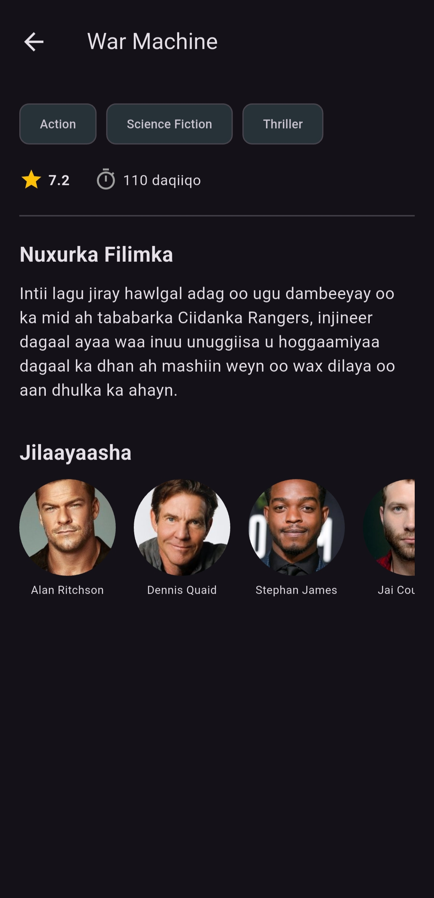
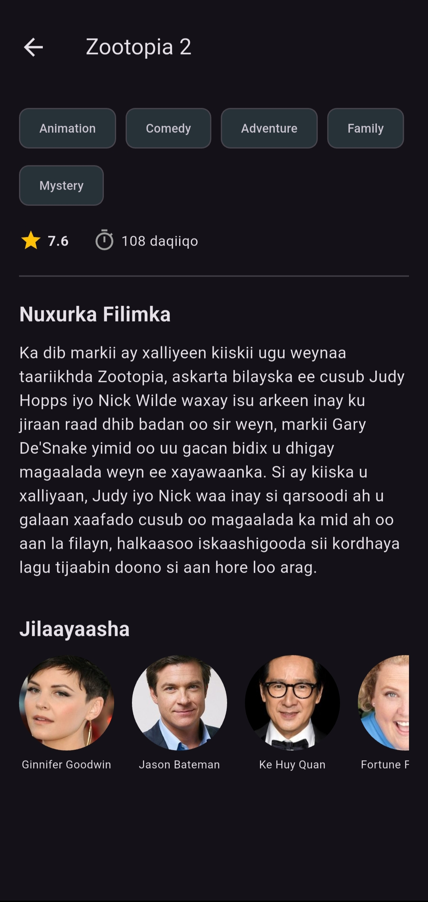

# filim faahfaahiye

### ​A sleek mobile application built with Flutter that allows users to explore the latest trending movies with localized descriptions in Somali. The app features a clean dark-mode interface for browsing movie details, ratings, and cast information.

​## App Preview

  
  
  

# How to Run
​ you can get it running locally by following these steps:
​## Prerequisites
​Flutter SDK installed
​Android Studio or VS Code
​An Android Emulator or physical device
​Installation & Execution
## Clone the repository

## Get dependencies:
 ` flutter pub get`

 ## Run the app:
 If you have your emulator running, just execute:
 ` flutter run `
